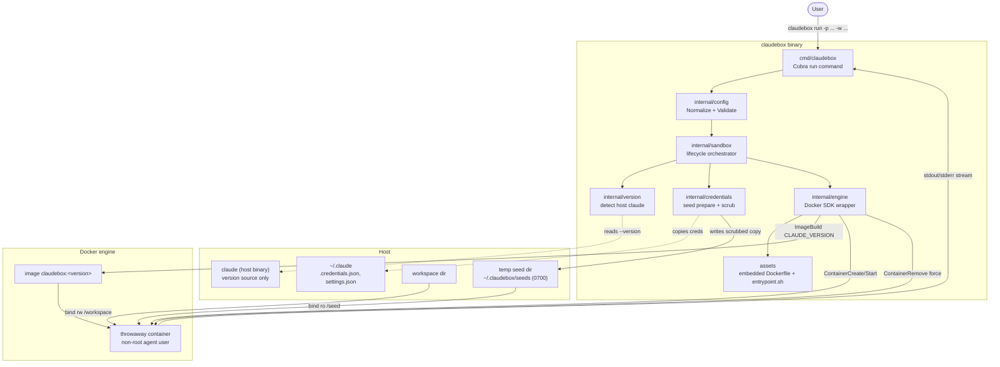
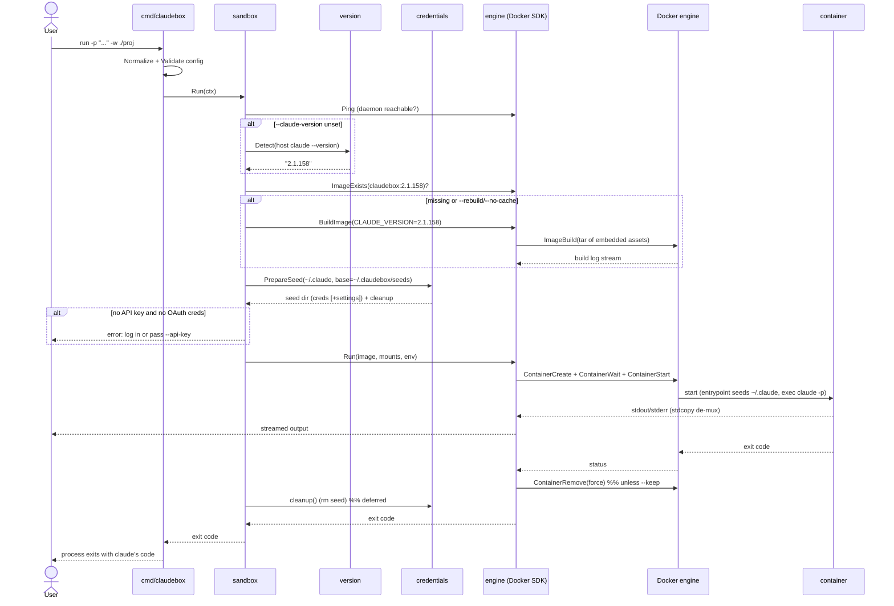
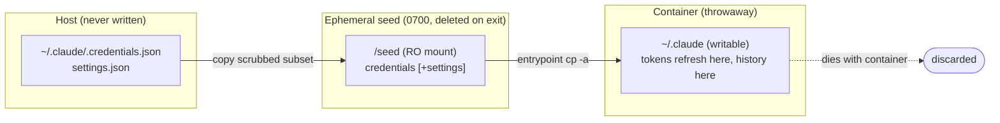

# Architecture

`claudebox` is a single Go binary that drives Docker to run Claude Code headless
in a throwaway container. The Dockerfile and entrypoint are embedded via
`go:embed`, so there are no runtime file dependencies.

## System Overview

## Run lifecycle (sequence)

## Credential isolation (why a seed copy)

OAuth tokens refresh at runtime (Claude rewrites `.credentials.json`), so the
in-container `~/.claude` must be writable. Mounting the host dir read-only would
break refresh and history; mounting it read-write would pollute the host. The
seed-copy pattern keeps the host untouched and read-only while giving the
container a writable, disposable copy.

## Component responsibilities

| Package | Responsibility | Key types/functions |
|---------|----------------|---------------------|
| `cmd/claudebox` | CLI surface, flag parsing, exit-code propagation | `runCmd`, `runE`, `exitCodeError` |
| `internal/config` | Config struct, defaults, validation | `Config`, `Normalize`, `Validate`, `ResolvedImageTag` |
| `internal/version` | Detect/parse host Claude version | `Detect`, `Parse` |
| `internal/credentials` | Prepare scrubbed ephemeral seed | `PrepareSeed`, `Seed`, `DefaultClaudeHome` |
| `internal/engine` | Docker build/run/stream/remove | `Engine`, `BuildImage`, `Run`, `ImageExists` |
| `internal/sandbox` | Orchestrate the lifecycle | `Sandbox`, `Run`, `defaultSeedBase` |
| `assets` | Embedded build context | `Dockerfile`, `Entrypoint` |
